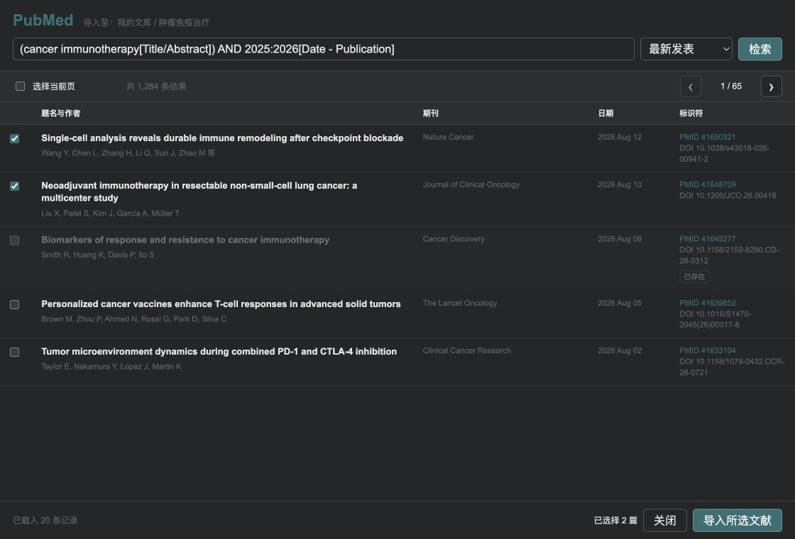

<p align="center">
  
</p>

<h1 align="center">PubMed Search & Import — Zotero 9 Plugin</h1>

一款专为 **Zotero 9** 设计的 PubMed 文献检索与导入插件。无需离开 Zotero，即可检索 PubMed、筛选文献，并将题录批量导入当前文库或分类。

[](https://github.com/nkbaim/pubmed-importer/releases/latest)
[](https://www.zotero.org/)

## 界面预览



> Zotero 9 深色模式界面；截图中的检索结果为展示用示例数据。

## 功能

- 支持 PubMed 检索式，并按最佳匹配或发表日期排序
- 分页浏览题名、作者、期刊、日期、PMID 和 DOI
- 选择当前页或跨页选择多篇文献后批量导入
- 导入到当前 Zotero 文库或选中的分类
- 自动识别当前文库内已有的 PMID，避免重复导入
- 使用 Zotero 内置 PMID 翻译器保存规范题录
- 默认不下载附件
- 适配浅色和深色界面

## 兼容性

本插件面向 **Zotero 9** 开发和发布。插件清单中的最低版本 `8.999` 是 Zotero 9 系列的兼容性边界写法；当前版本以 Zotero 9 作为主要支持环境。

## 安装

1. 从 [最新版本页面](https://github.com/nkbaim/pubmed-importer/releases/latest) 下载 `zotero-pubmed-importer-*.xpi`。
2. 在 Zotero 中打开“工具 → 插件”。
3. 将 `.xpi` 文件拖入插件窗口，或通过齿轮菜单选择“从文件安装插件”。
4. 安装完成后，如有提示请重启 Zotero。

> Zotero 插件拥有访问本地文库的权限。请只从本仓库的 Releases 页面下载安装包。

## 使用方法

1. 在 Zotero 左侧选择目标文库或分类。
2. 点击工具栏中的 PubMed 图标，或选择“工具 → 检索 PubMed 并导入…”。
3. 输入 PubMed 检索式，例如：

   ```text
   (lung cancer[Title/Abstract]) AND 2024:2026[Date - Publication]
   ```

4. 勾选需要的记录，然后点击“导入所选文献”。

插件会跳过目标文库中 PMID 相同的记录。跨页勾选会保留，直到完成导入或关闭窗口。

## 网络与隐私

检索时，插件会直接访问 NCBI Entrez E-utilities 的 `ESearch` 和 `ESummary` 接口。导入时由 Zotero 内置 PMID 翻译器获取完整题录。插件不包含遥测，不会将 Zotero 文库内容发送到项目作者的服务器。

## 从源码构建

macOS 或 Linux 环境需要 `bash`、`node`、`python3`、`zip` 和 `shasum`：

```bash
./scripts/check.sh
./scripts/build.sh
```

安装包会生成在 `dist/` 目录。创建与 `manifest.json` 版本一致的 `v*` 标签后，GitHub Actions 也会自动构建 XPI 并创建 GitHub Release。

## 项目结构

```text
.
├── bootstrap.js                 # 插件生命周期与 chrome 注册
├── manifest.json                # Zotero 插件清单
├── icon.svg
├── content/
│   ├── pubmed-importer.js       # 菜单、工具栏与窗口入口
│   ├── pubmed-search.xhtml      # 检索窗口
│   ├── pubmed-search.js         # 检索、去重与导入逻辑
│   └── pubmed-search.css        # 界面样式
└── scripts/
    ├── build.sh                 # 生成 XPI
    └── check.sh                 # 发布前静态检查
```

## 已知限制

- 每页显示 20 条 PubMed 结果。
- 导入过程需要连接 NCBI；网络错误会计入失败数量，可稍后重试。
- 去重范围是当前目标文库，以 PMID 为准。
- 插件只导入题录，不自动保存全文或其他附件。

## 版本记录

参见 [CHANGELOG.md](CHANGELOG.md)。

## 反馈

请通过 [GitHub Issues](https://github.com/nkbaim/pubmed-importer/issues) 报告问题，并附上 Zotero 版本、插件版本和可复现的检索式。
